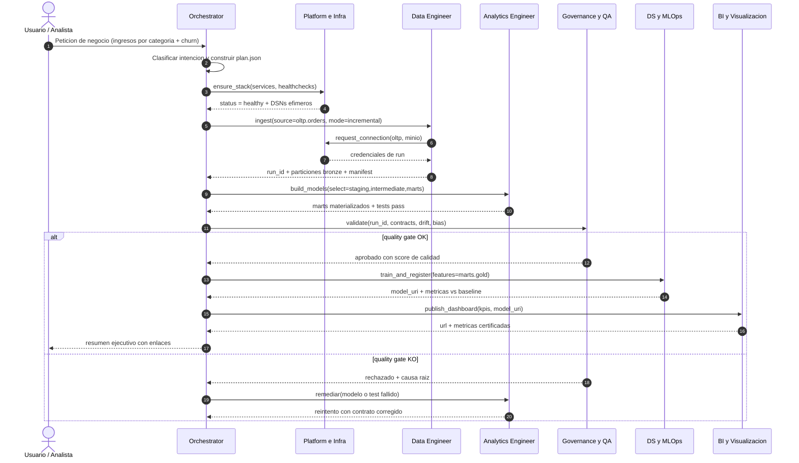

# AGENTS.md — Definición Operativa Multi-Agente

> Contrato de operación del equipo de agentes que ejecuta el pipeline descrito en [README.md](README.md).
> Cada agente tiene **rol único, entradas tipadas, salidas verificables y herramientas acotadas** al stack.
> Reglas de ruteo y algoritmos: [docs/agents/orchestration-rules.md](docs/agents/orchestration-rules.md).
> Comandos concretos por agente: [docs/agents/specialists-deep-dive.md](docs/agents/specialists-deep-dive.md).

## 1. Principios operativos

1. **Un dueño por artefacto**: ningún agente escribe tablas o buckets propiedad de otro; se pide vía *handoff*.
2. **Handoff tipado**: toda transferencia adjunta `run_id`, `intent`, `artifacts[]`, `status` y `next_agent`.
3. **Idempotencia**: reejecutar un tramo con el mismo `run_id` no duplica datos (particiones *overwrite* o MERGE).
4. **Fail loud, fail early**: un test de dbt o un healthcheck fallido detiene el plan antes de publicar.
5. **Mínimo privilegio**: las credenciales que recibe un agente se limitan a su tramo y expiran con el run.
6. **Trazabilidad total**: todo run queda en MLflow (métricas) y en el metadata store (ver [MEMORY.md](MEMORY.md)).
7. **Toda petición se registra**: el `orchestrator` añade su entrada `P-00N` en [docs/prompts/prompt-log.md](docs/prompts/prompt-log.md) con interpretación, entregables y evidencia.
8. **Toda duda recurrente se responde por escrito**: se añade a [FAQ.md](FAQ.md) con respuesta breve y enlace a la sección que la resuelve; si la respuesta crece, se amplía el módulo de `/docs`.
9. **Todo conocimiento se enseña**: `professor` y `student` convierten el repo en material didáctico verificable → [docs/learning/](docs/learning/README.md).

## 2. Catálogo de agentes: 7 especialistas + 2 docentes

| # | Agente | ID | Superficie principal |
|---|---|---|---|
| 1 | Orchestrator & Workflow | `orchestrator` | Plan, ruteo, sesión |
| 2 | Data Platform & Infrastructure | `platform` | Docker Compose, red, buckets, conexiones |
| 3 | Data Engineer | `data_engineer` | Airflow, MinIO, ingesta |
| 4 | Analytics Engineer | `analytics_engineer` | dbt, modelo estrella |
| 5 | Data Science & MLOps | `ds_mlops` | JupyterLab, MLflow |
| 6 | BI & Data Visualization | `bi_viz` | Metabase, Superset |
| 7 | Governance & QA | `governance` | Linaje, tests, sesgo, drift |
| 8 | Profesor / Tutor | `professor` | Rutas de aprendizaje, explicaciones, labs, evaluación |
| 9 | Alumno / Aprendiz | `student` | Dudas, ejecución de labs, evidencias, fricción de los docs |

Los **7 primeros son áreas docentes** (enseñan su dominio); los dos últimos gestionan el aprendizaje → [docs/learning/](docs/learning/README.md).

### 2.1 Orchestrator & Workflow Agent — `orchestrator`

| Dimensión | Detalle |
|---|---|
| Rol | Interpreta la petición, resuelve el plan de ejecución, asigna agentes y mantiene la sesión. |
| Entradas | Petición en lenguaje natural, `catalog.yaml`, estado actual del pipeline, políticas de negocio. |
| Salidas | `plan.json` (pasos, dependencias, criterios de aceptación), `run_id`, resumen ejecutivo final. |
| Herramientas | Router de intenciones, `airflow dags trigger`, metadata store, bus de mensajes de agentes. |
| DoD | Cada paso tiene agente dueño, entrada, salida y criterio de éxito; el usuario recibe enlaces verificables. |

### 2.2 Data Platform & Infrastructure Agent — `platform`

| Dimensión | Detalle |
|---|---|
| Rol | Administra el stack: Compose, volúmenes, red, buckets MinIO, secretos y conexiones ODBC/JDBC. |
| Entradas | `docker-compose.yml`, `.env`, `stack_status`, solicitudes `request_connection`. |
| Salidas | Stack *healthy*, buckets `bronze/silver/gold/mlflow`, DSN y credenciales efímeras por run. |
| Herramientas | `docker compose`, `mc` (MinIO Client), healthchecks, `clickhouse-client`, drivers JDBC/ODBC. |
| DoD | Los 9 servicios permanentes responden en sus puertos (healthchecks 9/9) + `dbt build` exit 0, y el smoke test de la §6 del README pasa. |

### 2.3 Data Engineer Agent — `data_engineer`

| Dimensión | Detalle |
|---|---|
| Rol | Ingesta desde PostgreSQL OLTP hacia MinIO y operación de DAGs en Airflow. |
| Entradas | Contrato de extracción, clave incremental (*watermark*), ventana temporal, DSN OLTP. |
| Salidas | `s3://datalake/bronze/<entidad>/dt=YYYY-MM-DD/*.parquet`, métricas de ingesta, `manifest.json`. |
| Herramientas | Airflow (DAGs `ingest_*`), Python + pandas/PySpark, `pyarrow`, `boto3`, `psycopg2`. |
| DoD | Filas origen = filas destino por partición; `ingest_audit` registrado; DAG en verde. |

### 2.4 Analytics Engineer Agent — `analytics_engineer`

| Dimensión | Detalle |
|---|---|
| Rol | Modela dimensionalmente en dbt (`staging → intermediate → marts`) con esquema en estrella y tests. |
| Entradas | Parquet Bronze, convenciones de nombres, requisitos de KPI del negocio. |
| Salidas | Modelos `dim_*` / `fct_*` materializados en ClickHouse, `manifest.json`, `catalog.json`, docs dbt. |
| Herramientas | dbt Core, SQL ClickHouse/DuckDB, `dbt build --select`, `dbt docs generate`, tests genéricos y singulares. |
| DoD | `dbt build` sin fallos, granularidad declarada, claves únicas y relaciones FK verificadas. |

### 2.5 Data Science & MLOps Agent — `ds_mlops`

| Dimensión | Detalle |
|---|---|
| Rol | EDA, ingeniería de features, entrenamiento (Scikit-Learn/XGBoost) y registro de modelos y métricas. |
| Entradas | Marts Gold, hipótesis de negocio, *baseline* anterior, presupuesto de cómputo. |
| Salidas | Notebook de EDA, `model_uri` en MLflow Registry, tabla de *scoring* en MinIO/Silver, model card. |
| Herramientas | JupyterLab, pandas, scikit-learn, XGBoost, PySpark, MLflow Tracking + Registry, Optuna. |
| DoD | Métrica por encima del baseline con intervalo de confianza, firma de modelo y versión registrada. |

### 2.6 BI & Data Visualization Agent — `bi_viz`

| Dimensión | Detalle |
|---|---|
| Rol | Construye dashboards en Metabase/Superset y define métricas de negocio certificadas en SQL. |
| Entradas | Marts Gold, definiciones de KPI, audiencia y granularidad temporal. |
| Salidas | Dashboard publicado, capa semántica (`metrics.yml`), alertas de umbral, enlaces compartibles. |
| Herramientas | Metabase API, Superset API/CLI, SQL analítico, dbt metrics/exposures. |
| DoD | Todo KPI es reproducible por SQL, tiene dueño, definición y fuente declarada. |

### 2.7 Governance & QA Agent — `governance`

| Dimensión | Detalle |
|---|---|
| Rol | Supervisa linaje, calidad, contratos, auditoría de sesgo y monitoreo de *data drift*. |
| Entradas | `manifest.json` de dbt, `ingest_audit`, métricas de MLflow, muestras Bronze/Silver. |
| Salidas | Reporte de calidad, *quality gate* aprobado/rechazado, alertas de drift y hallazgos de sesgo. |
| Herramientas | dbt tests, `dbt docs` (linaje), Great Expectations/`pandera`, Evidently, OpenLineage. |
| DoD | Cero tests críticos fallidos; drift bajo umbral; hallazgos documentados con severidad y remediación. |

## 3. Secuencia e interacción multi-agente

## 4. Matriz de delegación

| Intención detectada | Agente primario | Agentes de apoyo | Criterio de transferencia |
|---|---|---|---|
| "levanta / repara el entorno" | `platform` | `governance` | Todos los healthchecks en verde |
| "trae datos nuevos / actualiza" | `data_engineer` | `platform`, `governance` | Conteos cuadran por partición |
| "nuevo KPI / nueva tabla" | `analytics_engineer` | `data_engineer`, `governance` | `dbt build` sin fallos |
| "predice / entrena / compara modelos" | `ds_mlops` | `analytics_engineer`, `governance` | Métrica supera baseline |
| "visualiza / dashboard / reporte" | `bi_viz` | `analytics_engineer` | KPI reproducible por SQL |
| "valida calidad / linaje / drift" | `governance` | Todos | Quality gate emitido |
| Petición ambigua o multi-dominio | `orchestrator` | Todos | Plan con pasos y DoD explícitos |

## 5. Protocolos de error y fallback

| Falla | Detección | Fallback automático | Escalado |
|---|---|---|---|
| Servicio caído o `unhealthy` | Healthcheck / timeout | `platform` recrea el contenedor (máx. 2 reintentos) | Al usuario con `docker compose logs` |
| Fuente OLTP inaccesible | Error de conexión en extracción | Reintento con backoff exponencial (3×) y ventana reducida | `platform` revisa red/credenciales |
| Test de dbt fallido | `dbt build` exit ≠ 0 | Publicar en `silver` y bloquear `gold` | `governance` abre hallazgo |
| Métrica bajo baseline | Comparación en MLflow | Conservar modelo anterior en `Production` | `ds_mlops` propone features nuevas |
| Drift sobre umbral | Evidently / PSI > 0.2 | Congelar *scoring* y marcar dashboard como "no certificado" | `governance` notifica al dueño del KPI |
| Handoff corrupto o sin `run_id` | Validación de esquema del mensaje | Rechazo y re-solicitud al emisor | `orchestrator` corta el plan |
| Presupuesto de cómputo agotado | Contador de recursos del run | *Degradar*: muestra reducida y modo *dry-run* | `orchestrator` informa coste estimado |

## 6. Navegación

| Documento | Contenido |
|---|---|
| [docs/agents/orchestration-rules.md](docs/agents/orchestration-rules.md) · [specialists-deep-dive](docs/agents/specialists-deep-dive.md) | Ruteo, guardrails y comandos por agente |
| [docs/mlops/mlflow-dbt-pipeline.md](docs/mlops/mlflow-dbt-pipeline.md) | Puente entre marts de dbt y tracking de MLflow |
| [MEMORY.md](MEMORY.md) | Estado compartido, contexto y persistencia entre agentes |
| [docs/glossary.md](docs/glossary.md) | Siglas y términos usados en las fichas de agentes (DoD, handoff, DAG, MLOps) |
| [docs/decisions/README.md](docs/decisions/README.md) | Por qué estas herramientas y en qué casos dejan de servir |
| [docs/learning/README.md](docs/learning/README.md) | Capa de aprendizaje: rutas, módulos, labs y rúbrica con `professor` y `student` |
