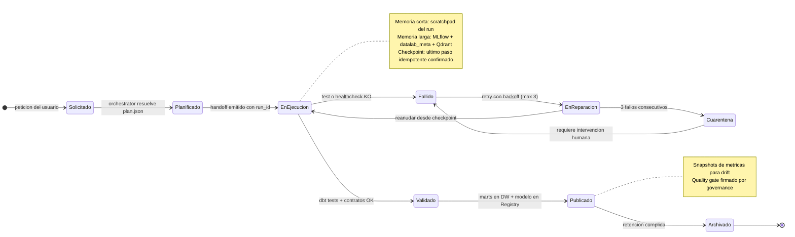

# MEMORY.md — Gestión de Estado, Contexto y Persistencia

> Cómo el entorno recuerda: qué vive en la conversación, qué se persiste en disco y qué se recupera por búsqueda semántica.
> Los agentes que consumen esta memoria se definen en [AGENTS.md](AGENTS.md); el esquema físico está en
> [docs/memory/memory-persistence.md](docs/memory/memory-persistence.md).

## 1. Modelo de dos velocidades

| Dimensión | Memoria a corto plazo | Memoria a largo plazo |
|---|---|---|
| Naturaleza | Contexto de conversación y ejecución | Conocimiento durable del dominio y del pipeline |
| Soporte | Ventana del agente + scratchpad del run | PostgreSQL `datalab_meta` + Qdrant + MLflow |
| Vida útil | Minutos (TTL del run) o la sesión | Meses (según política de retención) |
| Volatilidad | Alta; se descarta al cerrar el run | Baja; versionada e inmutable por append |
| Consulta | Lectura directa en contexto | Búsqueda semántica (top-k) + SQL |
| Riesgo | Olvido de contexto | Deriva semántica (*drift* de embeddings) |

## 2. Memoria a corto plazo (contexto de ejecución)

| Capa | Contenido | TTL | Dueño |
|---|---|---|---|
| `session_context` | Objetivo del usuario, preferencias, decisiones tomadas, historial de turnos | Sesión | `orchestrator` |
| `working_memory` | Plan activo, agente en curso, hipótesis descartadas, valores intermedios | Run | Agente activo |
| `run_state` | `run_id`, paso actual, checkpoints de idempotencia, reintentos consumidos | 7 días | `orchestrator` |
| `tool_cache` | Resultados de healthchecks, conteos y `dbt build` recientes | 15 min | Cada agente |
| `error_trace` | Última excepción, causa raíz y acción de *fallback* aplicada | 24 h | `governance` |

**Regla de compresión**: al superar el 70 % de la ventana de contexto, el `orchestrator` resume los turnos
antiguos en un `decision_log` y los persiste en `datalab_meta.session_events` antes de descartarlos.

## 3. Memoria a largo plazo (conocimiento persistente)

| Almacén | Qué guarda | Tecnología | Clave de recuperación |
|---|---|---|---|
| Metadata store | Runs, *handoffs*, quality gates, linaje lógico, `decision_log` | PostgreSQL `datalab_meta` | `run_id`, `intent`, `ts` |
| Vector DB | Documentación, model cards, incidentes, definiciones de KPI | Qdrant (colección `datalab_knowledge`) | Similitud coseno top-k |
| Model Registry | Versiones, etapas (`Staging`/`Production`), firmas y métricas | MLflow | `model_uri` |
| Artefactos dbt | `manifest.json`, `catalog.json`, resultados de tests | Volumen `dbt_artifacts` + MinIO | `dbt build` por `run_id` |
| Data Lake | Parquet Bronze/Silver/Gold y *scoring* batch | MinIO `s3://datalake` | Ruta particionada `dt=` |
| Bitácora de peticiones | Prompt inicial, interpretación y estado de cada `P-00N` | Markdown en Git + `session_events` | `P-00N`, `ts` |
| Métricas de plataforma | Estado de DAGs, duración, reintentos | Airflow Metadata DB | `dag_id`, `run_id` |

## 4. Ciclo de vida del dato y de la memoria



Transiciones relevantes:

| Transición | Disparador | Efecto sobre la memoria |
|---|---|---|
| `Planificado → EnEjecucion` | `orchestrator` emite `run_id` | Se crea `run_state` y `working_memory` |
| `EnEjecucion → Validado` | `dbt build` + quality gate en verde | Se persiste el linaje y la versión de features |
| `Validado → Publicado` | Modelo en `Production` y KPI certificado | Se indexa la model card en Qdrant |
| `Publicado → Archivado` | Retención cumplida (§6) | Parquet a *cold storage*; metadatos intactos |
| `Fallido → Cuarentena` | 3 reintentos agotados | Se emite incidente con `error_trace` completo |

## 5. Estado global del pipeline (ejemplo real de `run_state`)

```json
{
  "run_id": "run_2026-02-14T09-30-12Z_a13f",
  "intent": "revenue_by_category_and_churn",
  "status": "en_ejecucion",
  "current_step": "transform_dbt_marts",
  "current_agent": "analytics_engineer",
  "session": {
    "user": "analista_ventas",
    "objective": "Ingresos por categoria + propension de churn trimestral",
    "decision_log": [
      "Se reutiliza el modelo estrella existente en lugar de crear uno nuevo",
      "Se descarta XGBoost con 2000 arboles por presupuesto de computo"
    ]
  },
  "plan": [
    { "step": "ensure_stack", "agent": "platform", "status": "ok", "duration_s": 42 },
    { "step": "ingest_oltp_to_bronze", "agent": "data_engineer", "status": "ok", "duration_s": 118 },
    { "step": "transform_dbt_marts", "agent": "analytics_engineer", "status": "running" },
    { "step": "quality_gate", "agent": "governance", "status": "pending" },
    { "step": "train_churn_model", "agent": "ds_mlops", "status": "pending" },
    { "step": "publish_dashboard", "agent": "bi_viz", "status": "pending" }
  ],
  "artifacts": {
    "bronze": "s3://datalake/bronze/orders/dt=2026-02-14/part-000.parquet",
    "marts": ["marts.fct_orders", "marts.dim_customer", "marts.dim_product"],
    "model_uri": null
  },
  "memory": {
    "short_term_keys": ["session_context", "working_memory", "tool_cache"],
    "long_term_writes": ["datalab_meta.pipeline_runs", "datalab_meta.handoffs"],
    "vector_upserts": 0
  },
  "retries": { "ingest": 0, "dbt": 1, "total_budget": 3 },
  "quality_gate": { "status": "pending", "tests_passed": null, "drift_psi": null },
  "next_agent": "governance",
  "checkpoint": "marts.stg_orders materializado"
}
```

## 6. Persistencia, volúmenes y retención

| Volumen Docker | Montaje | Contenido | Retención |
|---|---|---|---|
| `pgdata` | `/var/lib/postgresql/data` | OLTP + base `datalab_meta` | Indefinida (backup semanal) |
| `minio_data` | `/data` | Bronze/Silver/Gold + artefactos MLflow | Bronze 90 d, Silver/Gold 365 d |
| `clickhouse_data` | `/var/lib/clickhouse` | Marts dimensionales | 365 d |
| `mlflow_artifacts` | `/mlartifacts` | Modelos, firmas, *runs* | 730 d |
| `airflow_logs` | `/opt/airflow/logs` | Logs de tareas y DAGs | 30 d |
| *(bind mount)* | `./infra/jupyter/work` → `/home/jovyan/work` | Notebooks y datasets de trabajo | Indefinida (Git) |
| `metabase_data` | `/metabase-data` | Dashboards, usuarios, permisos | Indefinida |
| `superset_data` | `/app/superset_home` | Dashboards, datasets, conexiones | Indefinida |
| `dbt_artifacts` | `/usr/app/dbt/target` | `manifest.json`, `catalog.json`, `run_results.json` | 90 d (o por commit) |
| `qdrant_data` | `/qdrant/storage` | Embeddings de conocimiento | Reindexado trimestral |

Políticas de persistencia:

1. **Append-only**: los eventos de `session_events` y `handoffs` nunca se actualizan; se añaden correcciones.
2. **Idempotencia por `run_id`**: reejecutar un paso sobrescribe su partición, no la duplica.
3. **Backup**: `pg_dump datalab_meta` + `mc mirror local/datalake ./backup` antes de cada *release*.
4. **Borrado seguro**: `docker compose down -v` destruye todo el estado; documentar antes de ejecutarlo.
5. **Secretos**: nunca en memoria persistente; se inyectan por variables de entorno de corta vida.

## 7. Contrato de lectura para agentes

- **Antes de actuar**, un agente recupera: (a) `run_state` del `run_id`, (b) top-5 de Qdrant para el `intent`,
  (c) última versión de modelo en `Production`.
- **Después de actuar**, escribe: un `handoff` en `datalab_meta.handoffs`, sus métricas en MLflow y, si generó
  conocimiento reutilizable, un `upsert` en la colección vectorial.
- **Nunca** se escribe en memoria de largo plazo sin `run_id` ni `ts` (trazabilidad obligatoria).

## 8. Navegación

| Documento | Contenido |
|---|---|
| [docs/memory/memory-persistence.md](docs/memory/memory-persistence.md) | DDL del metadata store, colecciones vectoriales, backup/restore |
| [docs/agents/orchestration-rules.md](docs/agents/orchestration-rules.md) | Qué agente lee y escribe cada capa de memoria |
| [docs/mlops/mlflow-dbt-pipeline.md](docs/mlops/mlflow-dbt-pipeline.md) | Linaje de features y versionado de modelos |
| [README.md](README.md) | Mapa de servicios y verificación de volúmenes |
| [docs/glossary.md](docs/glossary.md) | Siglas de memoria y gobierno (`run_id`, `run_state`, Vector DB, PSI) |
