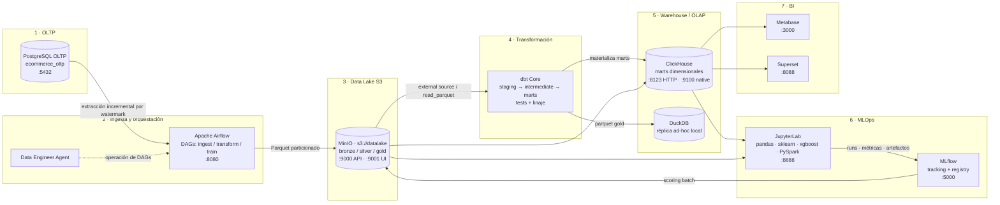

# DataLab Productivo Local — Modern Data Stack + MLOps

> Entorno local reproducible de **Ciencia e Ingeniería de Datos productiva**, concebido como **caso de estudio**
> para comprender un ambiente productivo de Data Science: qué hay detrás de un dashboard y de qué responde cada
> cargo → [docs/case-study.md](docs/case-study.md).
> Emula el stack que usan las empresas data-driven: OLTP → Data Lake → Lakehouse → DW → ML/BI, orquestado por
> Airflow, transformado con dbt, versionado con MLflow y operado por **9 agentes** (7 especialistas + `professor`
> y `student`).

| Campo | Valor |
|---|---|
| Dominio simulado | E-commerce transaccional (órdenes, clientes, productos, pagos) |
| Recorrido del dato | PostgreSQL OLTP → MinIO (Bronze) → dbt (Silver/Gold) → ClickHouse → ML/BI |
| Orquestador | Apache Airflow 2.9 (LocalExecutor) |
| Runtime | Docker Compose v2 sobre Linux / macOS / WSL2 |
| Equipo de agentes | 9 roles (7 especialistas + `professor` y `student`) en [AGENTS.md](AGENTS.md) |
| Estado y contexto | [MEMORY.md](MEMORY.md) |
| Verificación | Puerto por puerto, ver [§5](#5-verificación-de-servicios) |

## 1. Propuesta de valor

- **Paridad con producción**: mismas herramientas open source que un Modern Data Stack real (Airflow, dbt, MLflow, MinIO, ClickHouse), sin coste de nube y 100 % reproducible en una laptop.
- **Contratos explícitos**: cada capa tiene esquema, granularidad, dueño y *data contract* verificable por tests de dbt y por el Governance & QA Agent.
- **Trazabilidad end-to-end**: un `run_id` único viaja de la extracción OLTP hasta el modelo registrado en MLflow y el dashboard certificado.
- **Operación multi-agente**: el trabajo se reparte por especialidad, con reglas de ruteo, *handoffs* tipados y *fallback* definidos en [docs/agents/orchestration-rules.md](docs/agents/orchestration-rules.md).
- **Reproducibilidad**: todo el stack se levanta con un comando, se versiona con Git y se destruye sin residuos.

## 2. Mapa de servicios y puertos

| # | Servicio | Rol en el stack | Contenedor | Puerto host |
|---|---|---|---|---|
| 1 | PostgreSQL OLTP | Fuente transaccional (e-commerce) | `oltp-postgres` | 5432 |
| 2 | MinIO | Data Lake compatible con S3 (Parquet crudo) | `minio` | 9000 / 9001 (consola) |
| 3 | ClickHouse | Data Warehouse OLAP (modelo estrella) | `clickhouse` | 8123 (HTTP) / 9100 (native) |
| 4 | Apache Airflow | Orquestación ETL/ELT (DAGs) | `airflow` | 8080 |
| 5 | dbt Core | Transformación analítica + tests | `dbt` (efímero / perfil `transform`) | — |
| 6 | MLflow | Tracking de experimentos y Model Registry | `mlflow` | 5000 |
| 7 | JupyterLab | Entorno de experimentación Python/PySpark | `jupyter` | 8888 |
| 8 | Metabase | BI self-service | `metabase` | 3000 |
| 9 | Apache Superset | Dashboards avanzados | `superset` | 8088 |
| 10 | Qdrant | Memoria vectorial de los agentes (perfil `ml`) | `qdrant` | 6333 |

Detalle de imágenes, volúmenes, healthchecks y variables: [docs/infrastructure/docker-setup.md](docs/infrastructure/docker-setup.md).
**Siglas de esta tabla** (OLTP, OLAP, ELT/ETL, DAG, S3, BI, *one-shot*) y qué es y para qué sirve **cada servicio**: [docs/glossary.md](docs/glossary.md). **Por qué se eligió cada herramienta, cuándo no se recomienda y sus alternativas**: [docs/decisions/README.md](docs/decisions/README.md).

## 3. Arquitectura del pipeline de datos



Narrativa paso a paso del viaje del dato: [docs/architecture/data-pipeline.md](docs/architecture/data-pipeline.md).

## 4. Índice maestro de documentación

| Documento | Alcance | Tipo |
|---|---|---|
| [README.md](README.md) | Vista general, arquitectura, quickstart y verificación | Raíz |
| [AGENTS.md](AGENTS.md) | Catálogo operativo de los 7 agentes y protocolos | Raíz |
| [MEMORY.md](MEMORY.md) | Memoria corta/larga, estado global y persistencia | Raíz |
| [docs/case-study.md](docs/case-study.md) | **Descripción inicial: caso de estudio, iceberg de capas y mapa de cargos de la industria** | Raíz |
| [FAQ.md](FAQ.md) | Dudas y comentarios: consultas breves y enlace a la sección que las responde | Raíz |
| [docs/glossary.md](docs/glossary.md) | Siglas, términos y los 10 servicios explicados uno por uno | Referencia |
| [docs/architecture/data-pipeline.md](docs/architecture/data-pipeline.md) · [docs/infrastructure/docker-setup.md](docs/infrastructure/docker-setup.md) | Arquitectura e infraestructura: viaje del dato, servicios y puertos | Módulo |
| [docs/agents/orchestration-rules.md](docs/agents/orchestration-rules.md) · [docs/agents/specialists-deep-dive.md](docs/agents/specialists-deep-dive.md) | Agentes: ruteo, guardrails y comandos por especialista | Módulo |
| [docs/mlops/mlflow-dbt-pipeline.md](docs/mlops/mlflow-dbt-pipeline.md) · [docs/memory/memory-persistence.md](docs/memory/memory-persistence.md) · [docs/operations/runbook.md](docs/operations/runbook.md) | MLOps, persistencia, retención y runbook operativo | Módulo |
| [docs/learning/](docs/learning/README.md) · [curriculum](docs/learning/curriculum.md) · [professor y student](docs/learning/professor-and-student-agents.md) · [labs](docs/learning/exercises-labs.md) · [labs ML/BI](docs/learning/labs-quality-ml-bi.md) · [evaluación](docs/learning/assessment.md) · [rutina diaria](docs/learning/daily-routine.md) · [tareas `T-01`…`T-20`](docs/learning/daily-tasks.md) | **Aprendizaje y práctica laboral**: 9 módulos, 14 labs, rúbrica y 20 tareas diarias guiadas por `professor` y `student` | Aprendizaje |
| [docs/decisions/README.md](docs/decisions/README.md) · [storage-and-runtime](docs/decisions/storage-and-runtime.md) · [orchestration-and-transform](docs/decisions/orchestration-and-transform.md) · [ml-bi-and-memory](docs/decisions/ml-bi-and-memory.md) | Decisiones (ADR `D-01`…`D-18`): por qué, cuándo NO, alternativas, pros y contras | Referencia |
| [docs/prompts/initial-prompt.md](docs/prompts/initial-prompt.md) · [prompt-log.md](docs/prompts/prompt-log.md) · [archivo 2026-Q4](docs/prompts/archive-2026-Q4.md) | Prompt inicial literal, bitácora viva de peticiones (`P-00N`) y archivo histórico | Módulo |
| [docker-compose.yml](docker-compose.yml) · [.env.example](.env.example) · [.gitignore](.gitignore) | Stack ejecutable y configuración local | Ejecutable |

Regla de oro: ningún `.md` supera 200 líneas; lo que exceda se desglosa en `/docs` y se enlaza aquí.

## 5. Inicio rápido

```bash
# 1. Preparar entorno (WSL2/Linux/macOS) — el .env define COMPOSE_PROFILES=core,orchestration,ml,bi
cp .env.example .env          # ajustar credenciales locales

# 2. Levantar el stack completo (perfiles tomados del .env)
docker compose up -d

# 3. (Opcional) perfiles parciales: solo núcleo, solo BI, solo ML
docker compose --profile core up -d
docker compose --profile bi up -d
docker compose --profile ml up -d

# 4. Ver estado y salud (9 servicios con healthcheck + `dbt` efímero)
docker compose ps
docker compose logs -f airflow
```

Arranque en frío esperado: **3–6 minutos**. ClickHouse y Airflow son los últimos en reportar *healthy*.

### Secuencia de bootstrap (una sola vez)

```bash
docker compose up -d minio-init                     # crea bronze/silver/gold/mlflow (idempotente)
docker compose exec airflow airflow dags list
docker compose exec airflow airflow dags trigger ingest_oltp_to_bronze
```

## 6. Verificación de servicios

| Servicio | URL / comando de verificación | Resultado esperado |
|---|---|---|
| PostgreSQL OLTP | `docker compose exec oltp-postgres pg_isready -U $POSTGRES_USER` | `accepting connections` |
| MinIO API | `curl -sI http://localhost:9000/minio/health/live` | `200 OK` |
| MinIO consola | <http://localhost:9001> | Login con `MINIO_ROOT_USER` |
| ClickHouse | `curl -s 'http://localhost:8123/?query=SELECT%201'` | `1` |
| Airflow | <http://localhost:8080> (`admin` / ver `.env`) | 3 DAGs visibles |
| MLflow | <http://localhost:5000/health> | `OK` |
| JupyterLab | <http://localhost:8888/lab?token=$JUPYTER_TOKEN> | Notebook `01_eda_orders.ipynb` |
| Metabase | <http://localhost:3000> | Asistente de primer arranque |
| Superset | <http://localhost:8088> | Login `admin` / `admin` |
| Qdrant | `curl -s http://localhost:6333/healthz` | `healthz check passed` |

Smoke test integral (una línea, valida las 3 capas):

```bash
docker compose exec airflow airflow dags test ingest_oltp_to_bronze 2026-01-01 && \
docker compose exec airflow airflow dags test transform_dbt_marts 2026-01-01 && \
docker compose exec airflow airflow tasks test train_churn_model register_model 2026-01-01
```

## 7. Operación, reglas y troubleshooting

La operación diaria (arranque, consultas al OLTP, inspección del lake, reconstrucción de marts), las reglas
de oro del repositorio, el troubleshooting consolidado y los *playbooks* de recuperación viven en
**[docs/operations/runbook.md](docs/operations/runbook.md)**.

Ciclo de trabajo en una línea: petición de negocio → **Orchestrator** → agentes especialistas → *quality gate*
de **Governance & QA** → publicación en BI y consolidación en memoria ([AGENTS.md](AGENTS.md), [MEMORY.md](MEMORY.md)).
Para **aprender** el proyecto, la ruta guiada está en [docs/learning/README.md](docs/learning/README.md).
