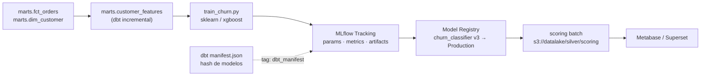

# MLflow × dbt — Pipeline de Features, Modelos y Drift

> Módulo de MLOps del [README.md](../../README.md). Explica cómo los marts de dbt alimentan el
> entrenamiento y cómo MLflow cierra el ciclo de trazabilidad hasta el dashboard.
> Modelo dimensional de origen: [data-pipeline.md](../architecture/data-pipeline.md).

## 1. Principio rector

**Los marts Gold son la única fuente de features.** Ningún notebook lee Bronze ni el OLTP directamente:
así se elimina el *training/serving skew* y el linaje queda garantizado por `manifest.json`.



## 2. Contrato de features

| Feature | Mart de origen | Tipo | Ventana | Regla de calidad |
|---|---|---|---|---|
| `recency_days` | `marts.customer_features` | int | 90 d | `>= 0` |
| `orders_last_30d` | `marts.customer_features` | int | 30 d | `>= 0` |
| `monetary_365d` | `marts.fct_orders` | decimal | 365 d | `>= 0` |
| `avg_ticket` | `marts.fct_orders` | decimal | 365 d | `>= 0` (0 = cliente inactivo) |
| `tickets_support_90d` | `staging.stg_support_tickets` | int | 90 d | `>= 0` |
| `churn_label` | derivada (etiqueta) | bool (`UInt8`) | 180 d | sin nulos |

```sql
-- extracto simplificado de models/marts/customer_features.sql
-- (el modelo real agrega sobre marts.fct_orders y staging.stg_support_tickets)
{{ config(materialized='incremental', unique_key='customer_id',
          incremental_strategy='delete+insert', tags=['gold','features']) }}

SELECT
    c.customer_id,
    dateDiff('day', max(o.order_date), today())            AS recency_days,
    countIf(o.order_date >= today() - 30)                  AS orders_last_30d,
    sum(o.total_amount)                                    AS monetary_365d,
    avg(o.total_amount)                                    AS avg_ticket,
    max(s.tickets_90d)                                     AS tickets_support_90d,
    (max(o.order_date) < today() - 180)                    AS churn_label
FROM {{ ref('dim_customer') }} c
LEFT JOIN {{ ref('fct_orders') }} o    ON o.customer_id = c.customer_id
LEFT JOIN {{ ref('int_support_90d') }} s ON s.customer_id = c.customer_id

WHERE c.updated_at > (SELECT max(updated_at) FROM {{ this }})

GROUP BY c.customer_id
```

## 3. Entrenamiento instrumentado

```python
import mlflow, mlflow.sklearn, hashlib, json
from sklearn.model_selection import train_test_split
from sklearn.metrics import roc_auc_score, average_precision_score
from xgboost import XGBClassifier

FEATURES = ["recency_days", "orders_last_30d", "monetary_365d",
            "avg_ticket", "tickets_support_90d"]

def manifest_hash(path="target/manifest.json") -> str:
    return hashlib.sha256(open(path, "rb").read()).hexdigest()[:12]

df = load_mart("marts.customer_features", run_id=RUN_ID)
X, y = df[FEATURES], df["churn_label"]
X_tr, X_te, y_tr, y_te = train_test_split(X, y, test_size=0.2, stratify=y, random_state=42)

with mlflow.start_run(run_name=f"churn_{RUN_ID}") as run:
    mlflow.set_tags({"run_id": RUN_ID, "dbt_manifest": manifest_hash(),
                     "feature_table": "marts.customer_features"})
    mlflow.log_params({"algo": "xgboost", "n_estimators": 400, "max_depth": 5,
                       "learning_rate": 0.08, "scale_pos_weight": 3.0})
    model = XGBClassifier(n_estimators=400, max_depth=5, learning_rate=0.08,
                          scale_pos_weight=3.0, random_state=42).fit(X_tr, y_tr)
    proba = model.predict_proba(X_te)[:, 1]
    mlflow.log_metrics({"roc_auc": roc_auc_score(y_te, proba),
                        "pr_auc": average_precision_score(y_te, proba)})
    mlflow.sklearn.log_model(model, "model", input_example=X_te.head(5),
                             registered_model_name="churn_classifier")
    mlflow.log_artifact("target/manifest.json")
```

## 4. Registro y promoción

| Etapa | Requisito para entrar | Quién promueve |
|---|---|---|
| `None` (recién registrado) | Run completado con firma de modelo | `ds_mlops` |
| `Staging` | `dbt test --select tag:critical` verde + *scoring* de prueba generado | `ds_mlops` |
| `Production` | ROC-AUC > baseline, PSI < 0.2, paridad demográfica aceptable, quality gate firmado | `governance` |
| `Archived` | Sustituido por una versión superior | `governance` |

```bash
# Promoción explícita y auditable (nunca automática sin gate)
mlflow models transition-stage --model-name churn_classifier --version 3 --stage Production
mlflow models get-latest-versions --model-name churn_classifier --stages Production
```

## 5. DAG que enlaza dbt y MLflow

```python
# dags/train_churn_model.py
with DAG("train_churn_model", schedule="0 4 * * *", catchup=False,
         tags=["mlops", "gold"]) as dag:

    build_features = BashOperator(
        task_id="build_features",
        bash_command="dbt build --select marts.customer_features --target prod")

    gate = BashOperator(task_id="quality_gate",
                        bash_command="dbt test --select tag:critical")

    train = BashOperator(
        task_id="train",
        bash_command="python pipelines/train_churn.py --run-id {{ run_id }}")

    register = BashOperator(
        task_id="register_model",
        bash_command="python pipelines/register.py --run-id {{ run_id }} --min-roc-auc 0.72")

    score = BashOperator(
        task_id="batch_scoring",
        bash_command="python pipelines/score.py --model churn_classifier --stage Production")

    build_features >> gate >> train >> register >> score
```

## 6. Reprocesos, linaje y drift

| Escenario | Procedimiento |
|---|---|
| Cambia la lógica de features | Nuevo `dbt build`; MLflow detecta `dbt_manifest` distinto y crea otro run |
| Modelo degradado en producción | Se conserva la versión previa en `Production` hasta superar el gate |
| *Data drift* | `qa.drift_report` compara `gold.customer_features` vs. ventana reciente: PSI > 0.2 congela *scoring* |
| *Concept drift* | Se reentrena con etiquetas nuevas y se compara contra el baseline en MLflow |
| Auditoría | `run_id` une Airflow → dbt (`manifest.json`) → MLflow → tabla de *scoring* → dashboard |

## 7. Navegación

| Documento | Contenido |
|---|---|
| [data-pipeline.md](../architecture/data-pipeline.md) | Cómo se construyen los marts de origen |
| [specialists-deep-dive.md](../agents/specialists-deep-dive.md) | Comandos de `ds_mlops` y `governance` |
| [memory-persistence.md](../memory/memory-persistence.md) | Dónde se persisten runs, artefactos y metadatos |
| [MEMORY.md](../../MEMORY.md) | Ciclo de vida del dato y de la memoria |
| [glossary.md](../glossary.md) | Siglas de MLOps y estadística (ROC-AUC, PR-AUC, PSI, drift) |
| [decisions/ml-bi-and-memory.md](../decisions/ml-bi-and-memory.md) | `D-13`…`D-16`: por qué MLflow, JupyterLab, este modelo y Qdrant |
